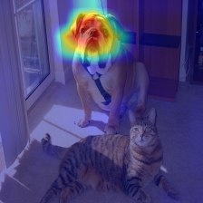
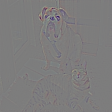
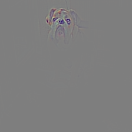
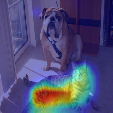
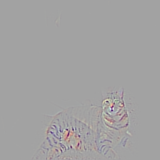

# chainer-grad-cam

Chainer implementation of Grad-CAM [1]. Grad-CAM can localize and highlight
important region in the image for predicting the concept without changing the
model architecture. Currently, this implementation supports AlexNet, VGGNet or ResNet to generate
CAM images.

## Summary

||Grad-CAM|Guided Backpropagation|Guided Grad-CAM|
|:-:|:-:|:-:|:-:|
|Boxer (242)||||
|Tiger Cat (282)||||

## Requirements

- Chainer
- Cupy (for GPU support)
- OpenCV

## Usage
```
python run.py --input images/dog_cat.png --label 242 --layer conv5_3 --gpu 0
python run.py --input images/dog_cat.png --label 282 --layer conv5_3 --gpu 0
```

## References

- [1] Ramprasaath R. Selvaraju, Abhishek Das, Ramakrishna Vedantam, Michael Cogswell, Devi Parikh, Dhruv Batra,
"Grad-CAM: Visual Explanations from Deep Networks via Gradient-based Localization",
https://arxiv.org/abs/1610.02391
